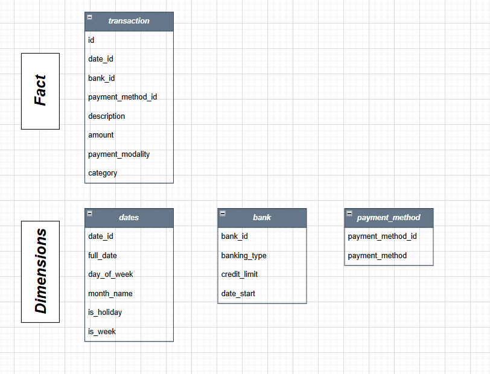
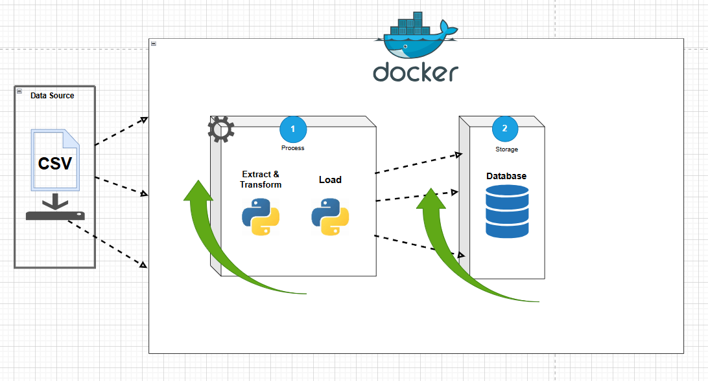
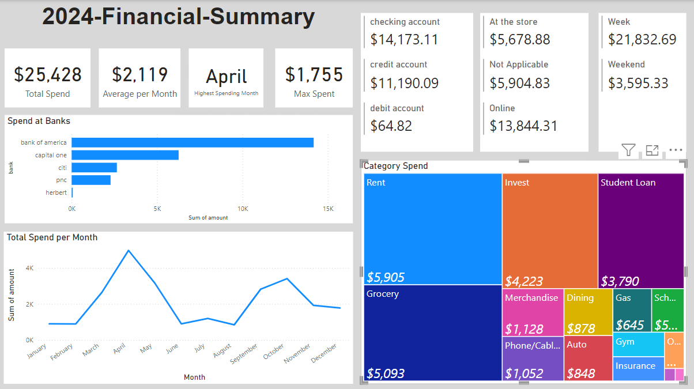

# 2024 Financial Summary

## Description
This project is a endeavear to encapsulate a story of my total spending and any expenditures incurrd during 2024. To preface that I was very excited to kicked off this initiative, it provides a clear anlytic view of where, what, when and how much I spend from each transaction and reveal my spending habit that I won't otherwise take into much deep thinking

## Content

### Objective and Overview
Download transactions data from bank accounts and processes them using Python scripts, stores the clean data in a PostgreSQL database while all the processes are running on docker's containers in a isolated environment

### Data Sources

1. **Primary Data Sources** (CSV Files):  
   - Capital One  
   - Bank of America  
   - Citi Bank  
   - PNC  
   - Herbert  

2. **Constructed Data** (Tables):  
   - bank  
   - payment_method  
   - dates

### Dimensional Model 
- **Fact Table**: transactions  
- **Dimension Tables**:  
  - bank  
  - payment method  
  - dates
    

*(image of the dimensional model)*  

### High-Level Process
### Sequential Flow of Actions
1. **Database Setup** (Container #1)  
   - Docker starts a PostgreSQL server.  
   - Creates the database and sets up schemas for the required tables.

2. **Data Extraction and Transformation** (Container #2)  
   - Docker runs the `extract_and_transform.py` script.  
   - The script processes the source data and generates `transaction.csv`.

3. **Data Loading** (Container #2)  
   - The `load.py` script loads `transaction.csv` and dimension tables into the PostgreSQL database. 

*(image of the high-level process)*  
## Final Product
### Dashboard/BI Application/Consumption/PowerBI
This is the analytical portion where dashboard is made, it gives a great summary on a glance to my overall financial performance

## Drill Down Questions + SQL Queries 
On top of the dashboard that I created, I also include a [list of queries](db-init/queries.sql) that aim to answer some customized questions in extension to my own curiosity.

